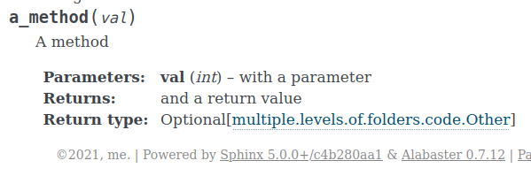
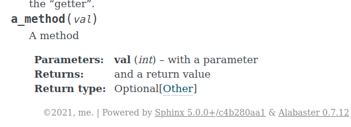

# Sphinx long types

Originally types that are imported with `from ... import ...`
```python
from multiple.levels.of.folders.code import Other
```
are shown with their full module as prefix (see return type):



With the proposed change in `sphinx.ext.autodoc` and the config option
```python
autodoc_typehints_types_qualified = "class-only"
```
the module is not prefixed to the type:



**Note:**

If a type-checking-only import is used
```python
if TYPE_CHECKING:
    from multiple.levels.of.folders.code import Other
```
the latter is always the default because the import is resolved as `ForwardRef[Other]`, and this is always shown without module prefix by `sphinx.ext.autodoc`.


## Testing this

To build the html:
```
python3 -m venv .venv
source .venv/bin/activate
pip install -r requirements.txt
make html
```
