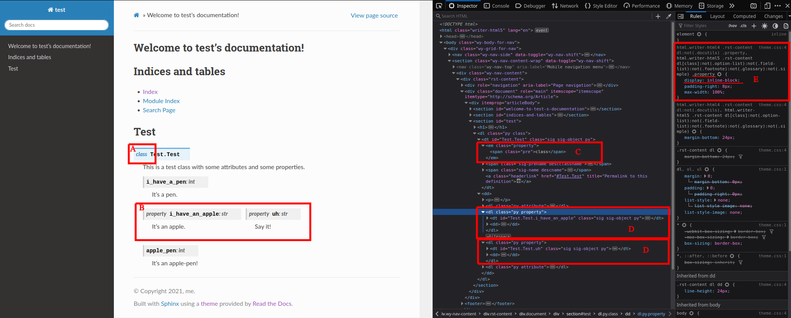

# RTD Property Issue



## Testing this

I checked in the html output, so just open `docs/_build/html/index.html` in a web browser.

To rebuild the html:
```
python3 -m venv .venv
source .venv/bin/activate
pip install -r requirements.txt
cd docs
make html
```
